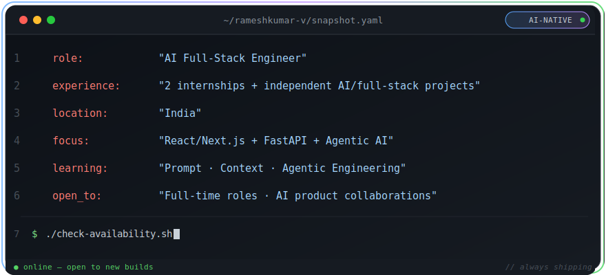

# 👋 Hi, I'm Rameshkumar V

### AI Full-Stack Engineer

*I design and ship AI-powered products — from interface to backend to autonomous agents.*

**React & Next.js · FastAPI · PostgreSQL · Agentic AI Systems**

 

 

## 📌 Quick Snapshot

🔍 Plain-text version (accessibility)

 

| | |
|---|---|
| 👨‍💻 **Role** | AI Full-Stack Engineer |
| 🎓 **Experience** | 2 internships + independent AI/full-stack projects |
| 🌍 **Location** | India |
| 🚀 **Focus** | AI-powered apps — React/Next.js + FastAPI + agents |
| 🤖 **Learning** | Prompt, context & agentic engineering |
| 🎯 **Open To** | Full-time roles · AI product collaborations |

 

> 💡 **Fresher by title, engineer by practice — I design systems, not just write code.**

 

## 🧠 About Me

AI-native full-stack engineer shipping products end to end — **React/Next.js** interfaces, **Python/FastAPI** backends, **PostgreSQL** data layers, and **agentic AI workflows** — treating prompt and context design as engineering, not guesswork.

 

## 🛠️ Tech Stack

**Frontend**

**Backend**

**Database**

**AI Tooling**

**Cloud & DevOps**

**Tools**

 

## 🗂️ Other Skills

 

## ✅ Core Skills

| | |
|---|---|
| ✅ Prompt Engineering | ✅ Context Engineering |
| ✅ Agentic Engineering | ✅ Sub-Agent Management |
| ✅ RESTful API Design | ✅ Full-Stack Architecture |
| ✅ Database Design | ✅ Clean, Modular Code |
| ✅ Containerization (Docker) | ✅ CI/CD Pipelines |
| ✅ GCP VM Management | ✅ Shell Scripting |

 

## 🎯 What I'm Suited For

- ✅ AI Full-Stack Engineer
- ✅ Python / FastAPI Backend Developer
- ✅ React / Next.js Developer
- ✅ Cloud & DevOps (GCP, Docker, CI/CD)
- ✅ AI Product Builds — from prompt design to shipped feature

 

## 📊 GitHub Statistics

 

## 🌐 Connect With Me

  
  
  
  

 

---

Rameshkumar V · AI Full-Stack Engineer

